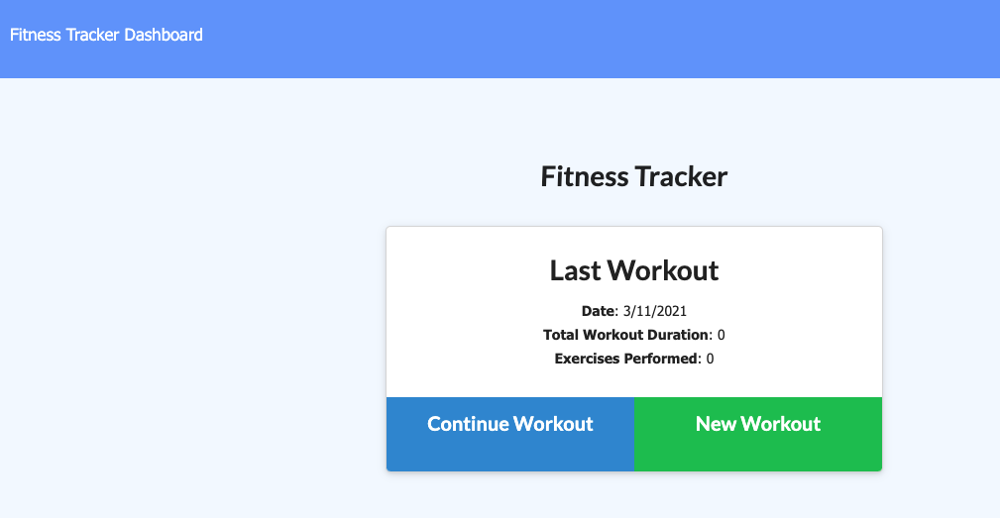
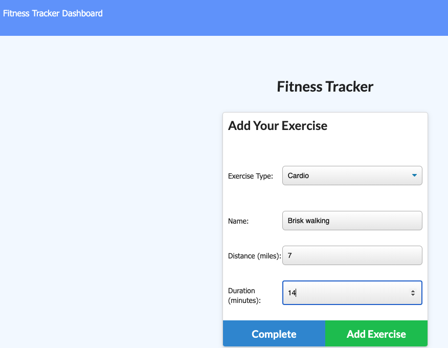
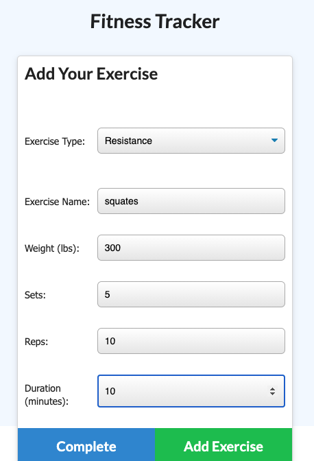

 # Workout_tracker_17

   ## License
   

   # Table of Contents

   * [Description](#Description)

   * [Runing a command-line application ](#Runing-a-command-line-application) 

   * [Installation Instructions](#installation-instructions)
  
   * [Usage Instructions](#usage-instructions)
  
   * [Contribution](#Contribution)
  
   * [Developers Contact Information](#Developers-Contact-Information)

   * [License](#license)

   # Description

   * This application is developed to view create and track daily workouts.
   * This application uses an express backend and fron end to save and retrieve node data from dbworkout. 
   * yuo can be able to log multiple exercises in a workout on a given day.
   * you can also be able to track the name, type,   weight, sets, reps, and duration of exercise. 
   * If the exercise is a cardio exercise, you can be able to track the distance traveled.
   * I included in package.js as dependence
   * I created models and routes to connect with back end codes.

   * That is a given dependence

   * npm install 

   * Acceptance Criteria.

   * users can quickly and easily loads the page, you will be get the option to create a new workout or continue with the last workout.

   * you can Add exercises to the most recent workout plan. 

   * you can search the combined weight of multiple exercises from the past seven workouts on the `stats` page

   * View the total duration of each workout from the past seven workouts on the `stats` page.
.

   #  Runing a command-line application 

   * You can Add or see the exercises.
   
   * You can  see the user's type of exercise, duration on database.
 
   * You can View the stored database in a database interms of line chart, bar chart, and pie chart.

   * The app runs as a `nodemon server.js or node server.js` to gather information about each exercises. 

   * My workout_tracker_17 mongodb, mongoose, and morgan that is readable, reliable, and maintainable Oftentimes, node_modules,  main Readme, Screenshots.

   * I put my LinkedIn profile, my github URL repository, heroku url and email address working activly.

   ## Installation Instructions

   * The developer is authorizing a free installation by cloning from the repository code:- 

   * [destish21/workout_tracker_17](https://github.com/destish21/workout_tracker_17)

   * you can run by install npm i to include node_module, express, morgan, mongoose, dev, and mongoDB_URL and localhost.

   * you can run by node `nodemon server.js or by node server.js` workout_tracker_17.

   # screenshot Image 1
   * 

   ## Usage Instructions

   * For this app to run make sure first:-

   * creat repository in your github, then clone the code from my github repository,

   * [destish21/workout_tracker_17](https://github.com/destish21/workout_tracker_17)

   * Install all necessary  node_moduales like express, morgan, mongoose.

   * Make sure node_modules run by `npm i or npm install`
     in your computer.

   * Once in the directory run npm install to install the node_modules needed to run the app.
    Run by  `node server.js or by nodemon server.js` in your computer command line.

   * You can add new or continue the form exercise on the application.

   * A `workout_tracker_17
     App !!`will be desplayed after you run the server.js !. 

   * you can manage your create and track daily workouts easly.

   * It built with diferent package to connect to my mongoose database and perform requeries `seeds.js` file and return all files.

   * models, routes to interact with the user the command-line.

   * you can to be able to delete and Update  you've members.

   * you can  quickly access to emails and GitHub profiles.

   * My `workout_tracker_17`
    is in my github repository enjoy it!
   * Screenshot Images 2
 
   * 
   * 
   * 
   * 
 
   ## Contribution

   * This is Contributed by [destish21/workout_tracker_17](https://github.com/destish21/workout_tracker_17). 
   
   * But Contribution, issues and feature requests are welcome.
   * Feel free to check issues page if you want to contribute. 
   * you can contact me by Contact Information here below.

   ## Developers Contact Information
   * LinkdIn Profile : [Desta Mulualem](https://www.linkedin.com/in/desta-mulualem-6718b1203/)
   * Deployed URL : N/A
   * github URL :  https://github.com/destish21/workout_tracker_17
   * MyGoogleDocLink: https://docs.google.com/document/d/12iqx2v9VJpYzte3qu6_S-YBiPkwCYKAXQQhI4bl02zM/edit?usp=sharing

   * Email: destish21@yahoo.com
   
   # Desta Mulualem. All Rights Reserved © 02/16/2021.
